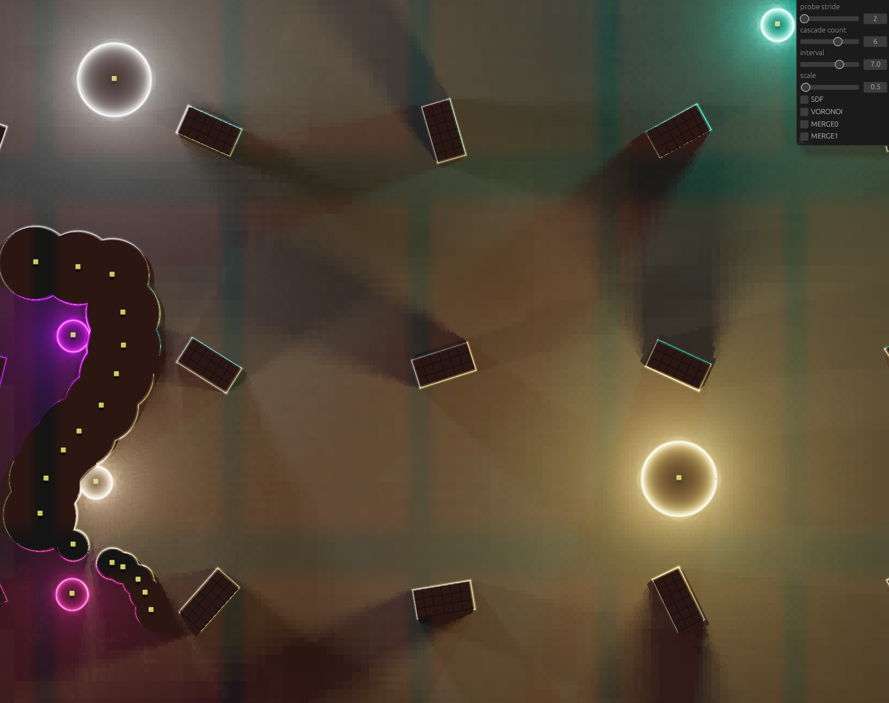

# Solis 2D

[](./LICENSE)
[](https://crates.io/crates/solis_2d)

### 2D global illumination with radiance cascades.



Featuring realistic 2D light, shadow and normal map calculation using
a optimized version of radiance cascade.

This crate is currently work in progress.

Aiming to be compatible with all targets.

### Checkout out the examples

```bash
cargo run --example light --features=dev
cargo run --example simple --features=dev
```

### How to use

Add the `SolisPlugin`.

```rust
app.add_plugins(SolisPlugin::default());
```

Create a special Camera2D with `hdr:true`.

```rust
RadianceCameraBundle {
    camera_bundle: Camera2dBundle {
        camera: Camera {
            hdr: true,
            ..default()
        },
        ..default()
    },
    radiance_cfg: RadianceConfig{..} // quality, perfomance & effects
    ..default()
}
```

Add `Emitter` Components to your entities. A Emitter can emit light
and be also an occluder at the same time. Any Emitter with a zero color (black)
or 0. Intensity just acts like an occluder.
Intensity below `0.` acts as a negative emitter and subtracts light from
the scene.

```rust
cmd.spawn((
    SpriteBundle {
        texture: server.load("box.png"),
        transform: Transform::from_xyz((x as f32) * 400., (y as f32) * 400., 1.),
        ..default()
    },
    Emitter {
        intensity: 0.0,
        color: Color::BLACK,
        shape: SdfShape::Rect(Vec2::new(50., 25.)),
    },
));

```

### Normal Maps

Normal maps are currently very experimental. For normals to work,
you need to provide a texture with the scenes normals. This is done
by syncing a second sprite with the normal on another render layer with
a second camera. (checkout the light example)

```rust
// you have to resize the image, each time the window resizes
let image_handle = images.add(create_image(Vec2::new(1024., 1024.)));

// add this component to the radiance camera
cmd.spawn((
    RadianceCameraBundle { .. },
    NormalTarget(image_handle.clone()),
));

// spawn the normal camera
cmd.spawn((
    Camera2dBundle {
        camera: Camera {
            target: RenderTarget::Image(image_handle),
            ..default()
        },
        ..default()
    },
    RenderLayers::layer(3), // any layer > 0 will do
));

// spawn a normal map sprite
cmd.spawn((
    SpriteBundle {
        texture: server.load("boxn.png"),
        ..default()
    },
    RenderLayers::layer(3),
    Spin(rand),
));
```

https://github.com/user-attachments/assets/858d7842-aed2-46b7-b001-7b87aa3e8ac0

https://github.com/user-attachments/assets/5c98a8c4-ae5b-4019-b147-ceba065f074b

# Amazing resources:

[Gm Shader Blog](https://mini.gmshaders.com/p/radiance-cascades2)

[Json's RC Blog](https://jason.today/rc)
